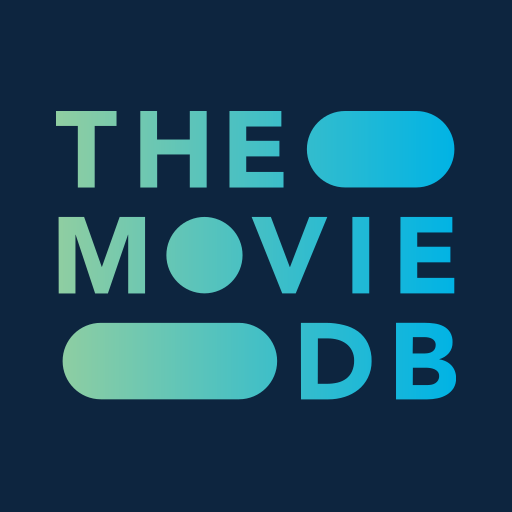

# TMDB para Kino

Catálogo e información de películas y series de [TMDB](https://www.themoviedb.org) para Kino, directo desde tu
aparato.

> This product uses the TMDB API but is not endorsed or certified by TMDB.
>
> Este producto usa la API de TMDB, pero TMDB no lo avala ni lo certifica.



## Qué hace

- **Inicio**: filas de Tendencias de hoy y de la semana, Películas y Series populares, Estrenos en cines,
  Próximamente en cines, Mejor valoradas, Series al aire y filas por género (Acción, Comedia, Terror,
  Animación, Ciencia ficción, Documental; series de Animación, Crimen y Drama). Cada fila tiene «Ver más»,
  con páginas hasta donde llegue TMDB.
- **Su propia sección** «TMDB» (Destacado, Películas, Series) y **Categorías** con 24 géneros.
- **Búsqueda** de películas y series. Si buscas a una persona («Keanu Reeves»), también aparecen sus títulos.
- **Capítulos** de cada serie, todas las temporadas, con imagen, sinopsis y fecha.
- **Información para los títulos de tus otras fuentes** (la capacidad `meta`): sinopsis, póster, fondo, logo,
  géneros, año, duración, calificación de TMDB, reparto y la lista de capítulos, buscados por su id de IMDb o de
  TMDB.
- **No reproduce nada.** Es un catálogo (`"catalogOnly": true`): desde Kino 0.9.54, al tocar un título Kino lo busca en
  tus otras fuentes («Buscar dónde verlo») y nunca lo ofrece como fuente. En Kino 0.9.53, que no conoce ese campo, el
  reproductor te dice que lo busques en tus otras fuentes.

El idioma sigue el de tu aparato (español de España, español latinoamericano o inglés) y el país decide los
estrenos en cines; los dos se pueden cambiar en la pestaña TMDB de Ajustes. Nunca muestra contenido para adultos.

## La conexión con TMDB

No necesitas hacer nada: el plugin funciona apenas lo instalas.

1. **Primero, la conexión de Kino.** Kino trae su propia llave de TMDB y guarda las respuestas en una caché
   compartida, así que no tienes que crear ninguna cuenta.
2. **Tu llave, como respaldo (opcional).** Si la conexión de Kino falla o llega a su límite, Kino usa tu propia
   llave, si pusiste una en **Ajustes ▸ «Tu llave de TMDB»** (o la de un addon de TMDB de Stremio que aprobaste).

Para tener tu llave de respaldo (es gratis): crea una cuenta en
[themoviedb.org](https://www.themoviedb.org/signup), entra a **Configuración ▸ API**, pide una llave para uso
personal y copia la «Clave de la API» (32 caracteres) o el «Token de acceso de lectura» en Ajustes ▸ «Tu llave de
TMDB».

Solo si la app no tiene ninguna conexión con TMDB, el plugin no muestra filas y te dice dónde poner tu llave. La
pestaña TMDB de Ajustes muestra si la conexión funciona.

## Privacidad

- **Solo habla con TMDB, y desde tu aparato.** No hay ningún servidor intermedio: Kino hace cada consulta a
  `api.themoviedb.org`, y las imágenes llegan de `image.tmdb.org`.
- **El plugin nunca ve ninguna llave**, ni la de Kino ni la tuya. Kino las guarda y agrega la que toque a cada
  consulta; el código del plugin solo pide rutas de TMDB (`kino.tmdb`) y recibe las respuestas.
- Guarda en el aparato una copia corta de las listas (unos minutos, para no repetir consultas y para mostrar algo
  si TMDB falla un rato). No guarda nada tuyo ni lo envía a ningún otro lado.

## Requisitos

Kino 0.9.53 o más nueva (la que trae `kino.tmdb`); desde Kino 0.9.54 sus títulos van directo a «Buscar dónde verlo». Las versiones 0.9.50 y anteriores no lo instalan («Este plugin
necesita una versión más nueva de Kino»); en 0.9.51 y 0.9.52 se instala, pero te pide actualizar la app.

## Para desarrolladores

- `plugin.js` es el plugin entero; `kino-plugin.json` su manifiesto. Solo usa `kino.tmdb(path, params)`, nunca
  `kino.fetch`, y declara `image.tmdb.org` como único host.
- `"catalogOnly": true` (Kino 0.9.54) dice que es un catálogo. `resolve` sigue declarado y exportado solo para Kino
  0.9.53, que ignora ese campo y lo exige; Kino 0.9.54 y posteriores nunca lo llaman.
- `sdk/` es el kit de Kino para Node (`run.mjs`, `validate.mjs`), con `contract.json` y `kino.d.ts` al lado.
- Pruebas, sin red ni llave (las respuestas de TMDB están en `test/fixtures/tmdb.json`, escritas a mano por
  `node test/make-fixtures.mjs`):

  ```sh
  node --test test/*.test.mjs
  node sdk/validate.mjs .
  KINO_TMDB_FIXTURE=test/fixtures/tmdb.json node sdk/run.mjs . home
  KINO_TMDB_FIXTURE=test/fixtures/tmdb.json node sdk/validate.mjs . --run meta tt0944947 series
  ```

- Con tu llave de verdad: `KINO_TMDB_KEY=<tu llave> node sdk/run.mjs . home` (o `"tmdbKey"` en `sdk/config.json`,
  que no va a git).

## Atribución y licencia

Los datos y las imágenes son de [TMDB](https://www.themoviedb.org). El logo de `icon.png` es el logo oficial de
TMDB, usado para la atribución que TMDB pide ([logos y atribución](https://www.themoviedb.org/about/logos-attribution)).
This product uses the TMDB API but is not endorsed or certified by TMDB.

El código es Apache-2.0 (ver `LICENSE` y `NOTICE`).
